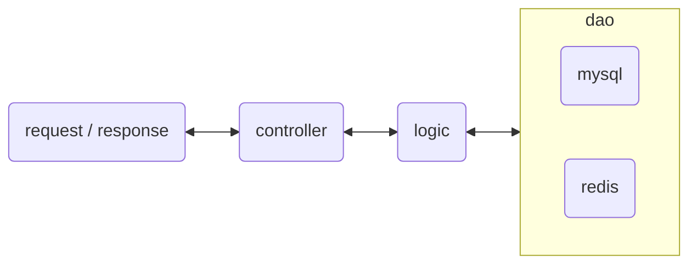

在该web项目中，所有请求的处理逻辑均大致如下图

```mermaid
graph LR
    A(request / response) <--> B(controller)
    B <--> C(logic)
    C <--> D(dao)

    subgraph D[dao]
        direction LR
        D1(mysql)
        D2(redis)
    end
```